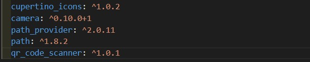
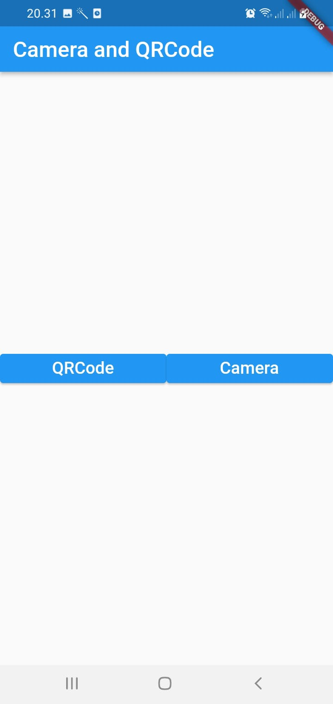
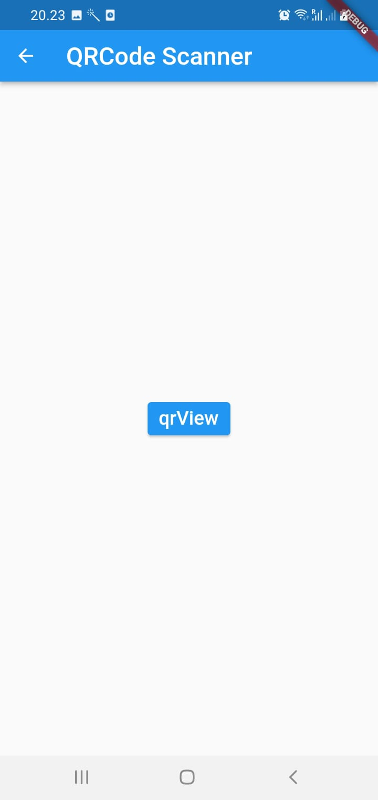
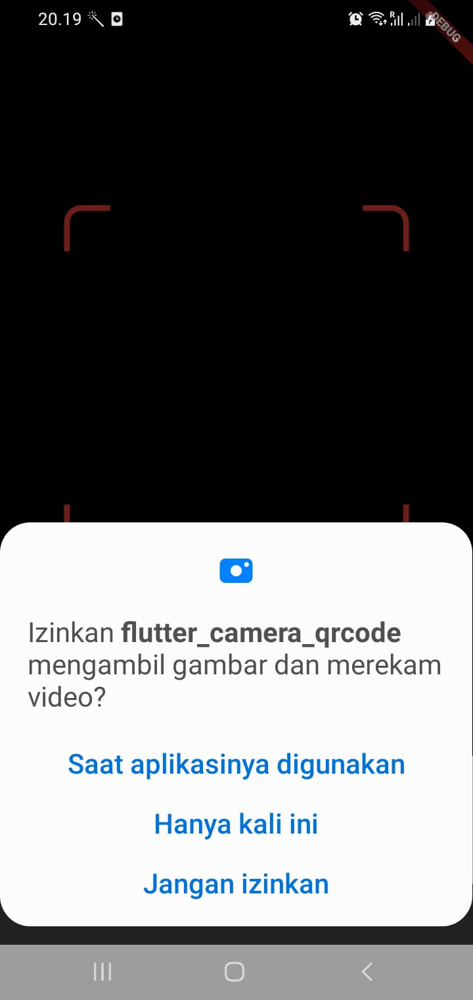
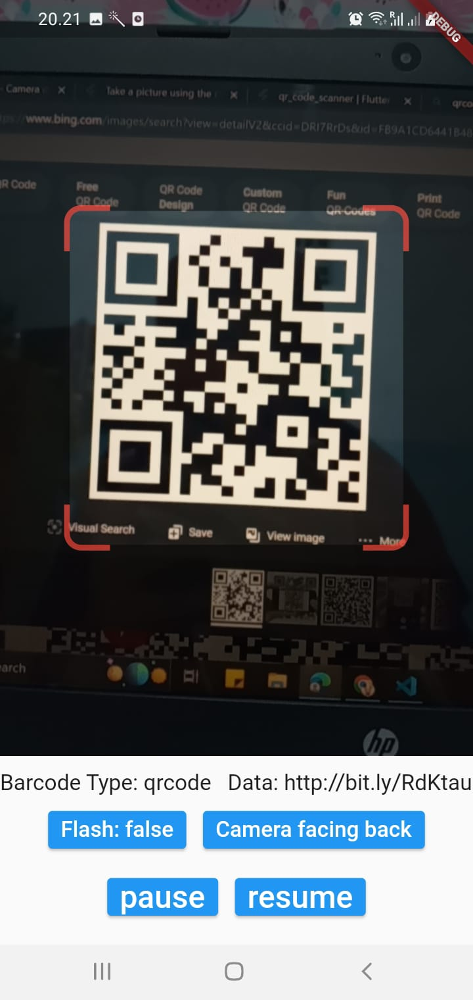
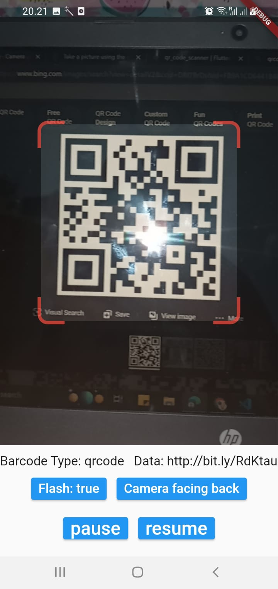
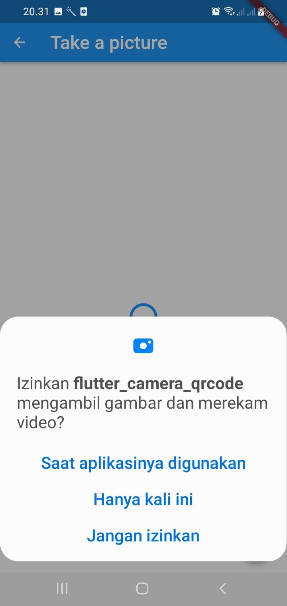
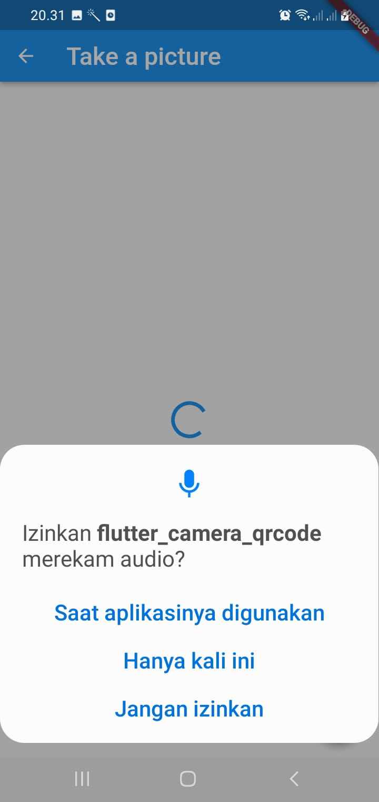
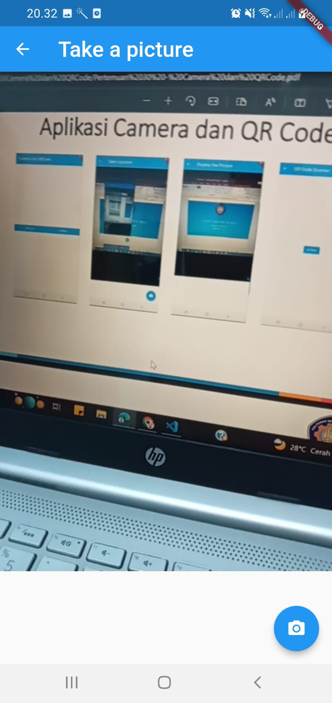
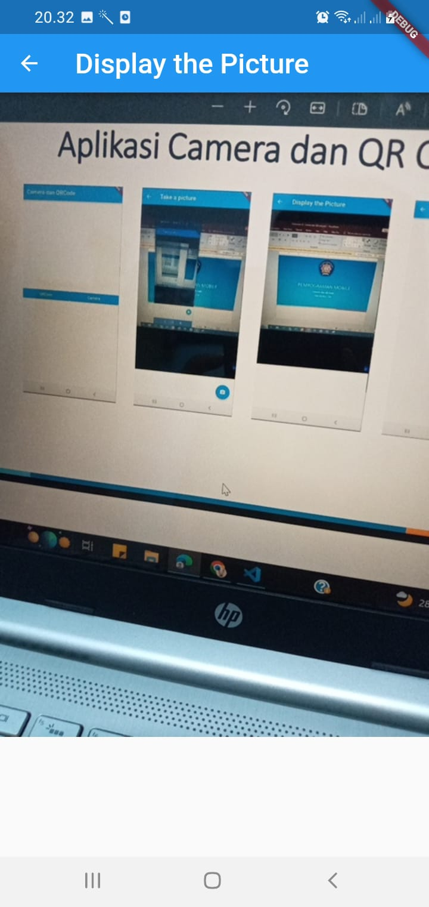

# flutter_camera_qrcode

### Menambahkan plugin pada `pubspec.yaml`

`camera`: digunakan membantu izin akses menuju hardware kamera pada device 
`path_provider`: membantu aplikasi Flutter untuk akses ke system file agar dapat menemukan lokasi file yang dimaksud seperti pada temporary file atau
direktori. 
`path`: digunakan untuk memanipulasi path sehingga string path bisa digabungkan, dipecah,dinormalisasi, dsb. 
`qr_code_scanner` membantu menyisipkan tampilan scanner pada aplikasi Flutter 

### Buka `android/app/buid.gradle` pastikan:

compileSdkVersion 32 dan minSdkVersion 21

### Membuat file `camera.dart`, `qrcode.dart` dan mengubah `main.dart`

### Hasil QRCode

  
 

### Hasil Camera

 
 
